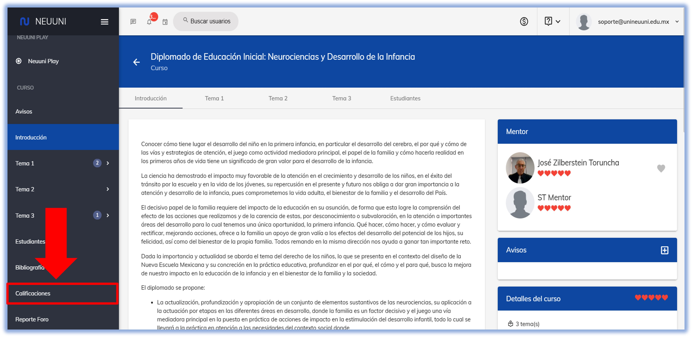
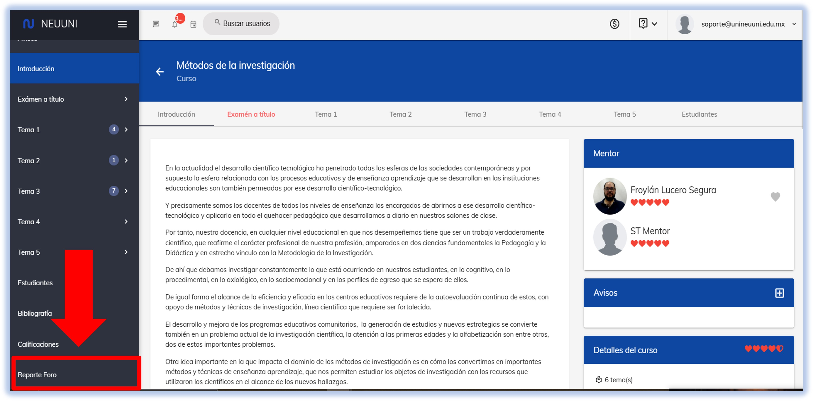
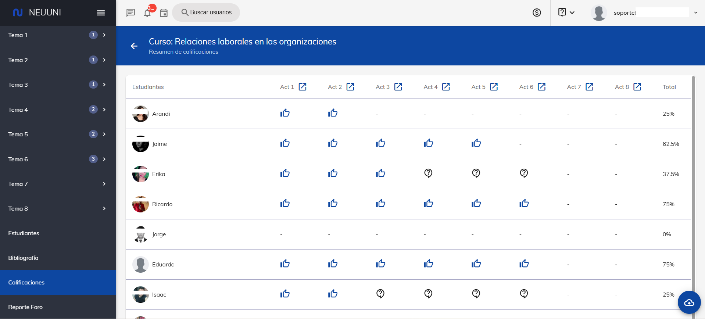
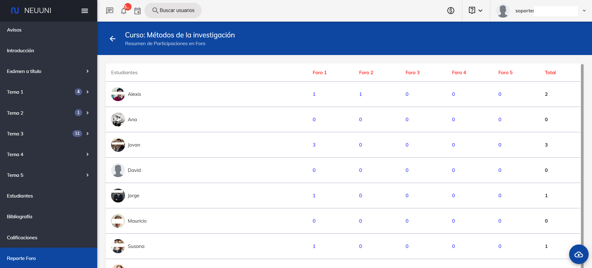
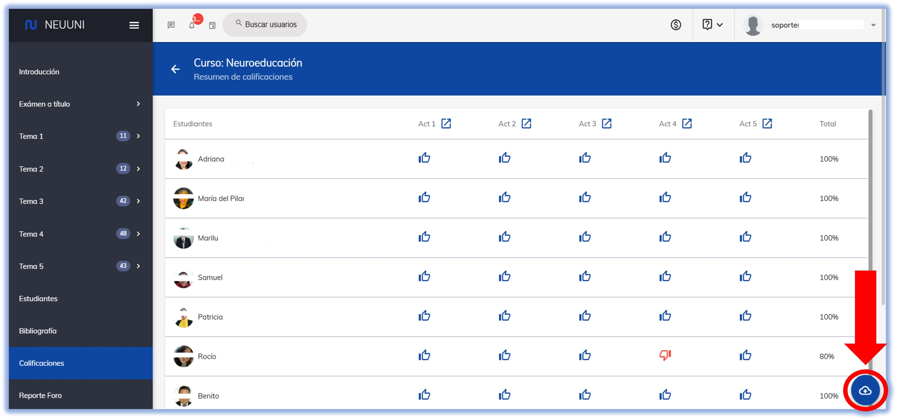

import VideoIntro from '@site/docs/tutorial-basics/insertarvideo.jsx';

# 📊 Reportes de Tareas y Foros

## Diagnostica tu grupo y previene la deserción

En este tutorial te guiaremos a través de las secciones **Reporte de Calificaciones**
y **Reporte de Foro**, dos secciones muy importantes que te ayudarán a visualizar
y dar seguimiento, de manera sencilla y eficaz, al envío de tareas y a la participación
de los estudiantes en los foros el curso.

Esta información nos permitirá realizar un diagnóstico oportuno de las actividades
de los estudiantes y tomar las medidas necesarias para evitar el fracaso estudiantil.

  

    📌 **NOTA:**   
    *Llevar un control correcto del grupo ayuda a prevenir la deserción estudiantil.*
  

### 1. ¿Qué son los reportes de calificaciones y foro?
Se trata de una página de la plataforma que ofrece un panorama completo y organizado
dela actividad de cada estudiante en la materia, ya sea en sus **envíos
de tarea** o en las **participaciones en foros**. **Su principal objetivo es
simplificar el seguimiento del desempeño y la interacción de los alumnos
para lograr un diagnóstico efectivo del grupo**.

### 2. ¿Cómo acceder al Reporte de Calificaciones/Foro?
1. Para comenzar, dirígete al menú que se encuentra en el lado izquierdo de tu pantalla.
2. Desplázate hacia la parte inferior y haz clic en la opción "**Calificaciones**" o "**Reporte de Foro**",  según sea el caso, tal como se resalta en las imágenes.

3. Al seleccionarla, serás dirigido a la página principal de esta función

### 3. Interpretando las tablas
La información se presenta en una tabla clara y estructurada. A continuación, te explicamos qué significa cada elemento:

- **Filas:** *Información por estudiante.*
	Cada fila de la tabla corresponde a un estudiante del curso. Podrás identificarlo por su foto de perfil y su nombre completo.

- **Columnas:** *Información por número de envío.* Cada una de estas columnas representa, ya sea el status del envío de la actividad del alumno, o el número de comentarios en el foro.
	
	- **Envío de Tarea.** Los íconos indican el status del último envío de la actividad:
		- ***Actividad satisfactoria*** 👍🔵 (mano con pulgar arriba en color azul).
		- ***Actividad insatisfactoria*** 👎🟥 (mano con pulgar abajo en color rojo).
		- ***Actividad pendiente de evaluar*** 💬❔◼️ (ícono de diálogo con un signo de interrogación dentro en color negro).
		- ***Actividad pendiente de ser enviada*** 💬❔🩶 (ícono de diálogo con un signo de interrogación dentro en color gris).
		
	

	- **Comentarios de Foro.** Las celdas indican la cantidad de comentarios o participaciones que el estudiante ha realizado en ese foro en particular.

	
		
- **Total**: La última columna a la derecha muestra la **suma total de las participaciones** de cada estudiante, sumando todos los comentarios que han realizado en todos los foros del curso.

### 4. Descargar el reporte
Para tu comodidad, la plataforma permite exportar toda esta información en un archivo de Excel. Para hacerlo, simplemente busca el **ícono de descarga** con una flecha apuntando hacia abajo, ubicado
en la parte inferior derecha de la tabla. Al hacer clic en ese botón, el sistema generará y descargará un archivo de Excel con el resumen completo de las participaciones que ves en pantalla.

¡¡Listo!! Así de fácil es consultar y gestionar el envío de actividades y la participación de tus estudiantes. Esperamos que esta herramienta te sea de gran utilidad para potenciar la interacción de tu curso.

## 🎥 Videotutorial

<VideoIntro title="Acceso al correo institucional" videoUrl="https://www.youtube.com/embed/Ki7SL03iqws" />