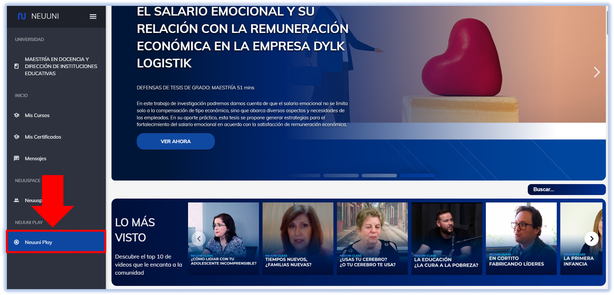
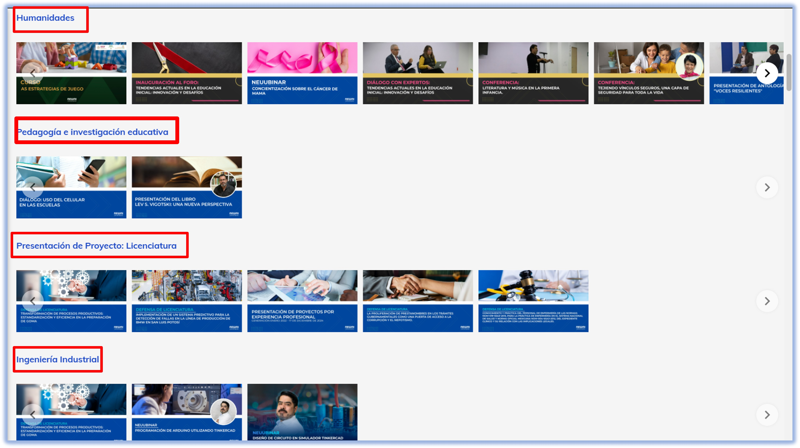
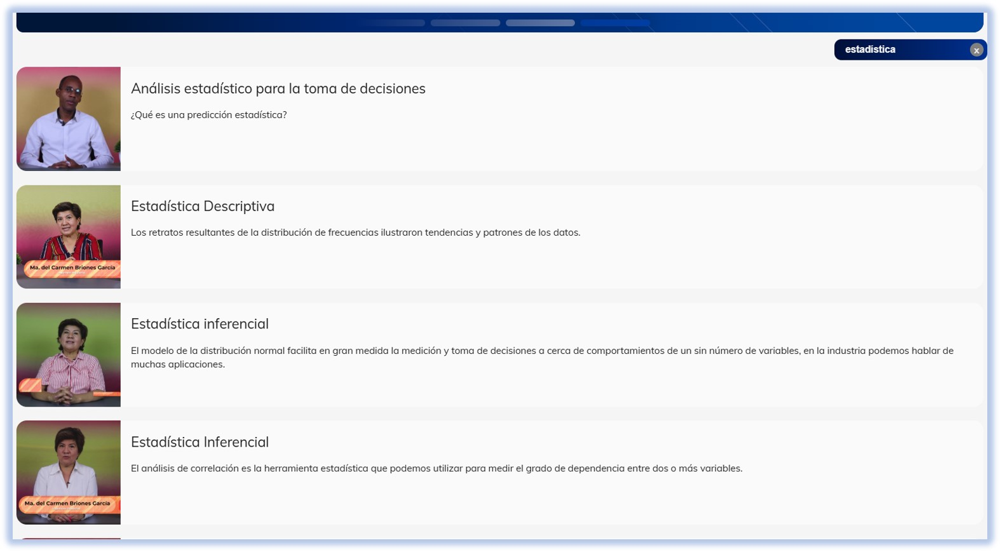
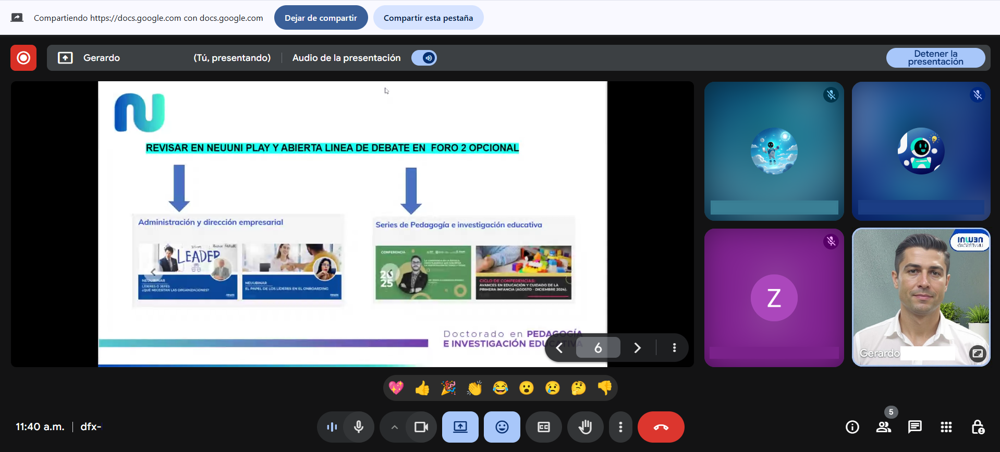

import VideoIntro from '@site/docs/tutorial-basics/insertarvideo.jsx';

# ‼️ Importancia de Neuuni Play

## Potencia el aprendizaje de tus alumnos

Sabemos que tu misión es guiar a tus alumnos hacia el éxito académico, y en NEUUNI nos esforzamos por brindarte todas las herramientas para lograrlo. Hoy vamos a enfocarnos en una sección que será tu aliada perfecta: **Neuuni Play**. ✨

Neuuni Play **reúne más de 400 series de videos y conferencias, abarcando desde temáticas profesionales hasta culturales**. Es un recurso dinámico y en constante crecimiento que te permite complementar tus sesiones con contenido audiovisual de alta calidad. 

## Organización del contenido

### Categorías 📂

Todo el contenido está cuidadosamente organizado y **dividido en categorías temáticas**, lo que permite navegar intuitivamente, encontrar videos relacionados con el área de interés, ayudar a explorar nuevos campos y descubrir temas de interés de manera sencilla y eficiente.

### Buscador 🔍

Neuuni Play implementa un **buscador** para ubicar fácilmente su contenido. Con solo escribir una **palabra clave**, tus alumnos podrán encontrar exactamente lo que necesitan. También, si estás preparando tu clase sincrónica y quieres proponer un debate con tus estudiantes, el buscador puede ahorrarte tiempo y esfuerzo al encontrar videos relevantes.

**El buscador permite acceder a un material mucho más amplio del que se muestra a primera vista**, más alla de los que se encuentran en las categorías principales, complementando su aprendizaje y brindándoles más información disponible. ¡Es una mina de oro para la investigación y el autoaprendizaje, y lo mejor, no deja de crecer! 💎

💡**Recuerda: Puedes grabar webinars, conferencias y otras actividades para incluirlas en este espacio. Para mayor información, contacta con Coordinación.** 👨‍🏫

## ¿Por qué recomendar Neuuni Play en tus clases? 🤔
- **Refuerzo y mejora del desempeño**: Los videos de Neuuni Play son un recurso adicional invaluable que puede reforzar significativamente la ruta de aprendizaje. 🧠
- **Ventaja competitiva y riqueza de recursos**: Al mostrar Neuuni Play, pones en evidencia la enorme cantidad de recursos con los que cuenta la plataforma Neuuni. Esto no solo enriquece la experiencia del alumno, sino que también subraya el compromiso de nuestra institución con su formación integral. 📚
- **Despertando la curiosidad y el sentido de pertenencia**: Neuuni Play es una ventana a las diversas actividades que se desarrollan en Neuuni. A través de las grabaciones de conferencias, webinars y otros eventos, tus alumnos descubrirán el dinamismo y la amplitud de nuestra comunidad, lo que sin duda despertará su curiosidad y reforzará su sentido de pertenencia a Neuuni. ¡Somos parte de algo grande! 🙌
- **Un puente hacia nuevas oportunidades**: al hacer más conocidas las actividades y grabaciones, Neuuni Play no solo informa, sino que también siembra la semilla para futuras implementaciones y oportunidades tanto para los alumnos como para la institución. 🌱

## Recomendación 💡
Te animamos a que, durante tus clases, **recomiendes un recurso específico** de Neuuni Play a tus alumnos. Puede ser un video directamente relacionado con el tema que estén viendo en clase, o quizás uno que consideres de interés general para su desarrollo. Te aconsejamos que especifiques, en la presentación de tu clase, la información que oriente a los estudiantes en la búsqueda del video (observa la imagen de referencia debajo):

Tu función como mentor es fundamental para que los alumnos descubran y aprovechen al máximo esta herramienta. ¡Anímalos a explorar Neuuni Play y a llevar su aprendizaje al siguiente nivel! 

---
#### *"Partimos de la práctica hacia la teoría, y luego regresar a la práctica, pero en un nivel más elevado de argumentación".*

<VideoIntro title="Recomienda Neuuni Play" videoUrl="https://www.youtube.com/embed/4PUO1vpdLTg" />