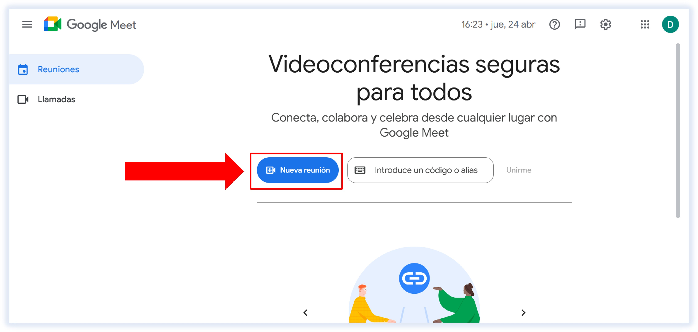
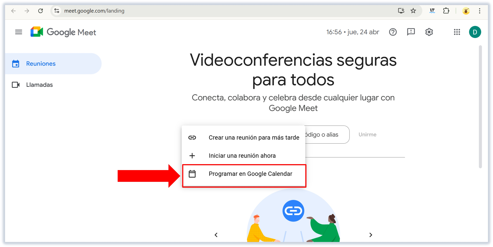
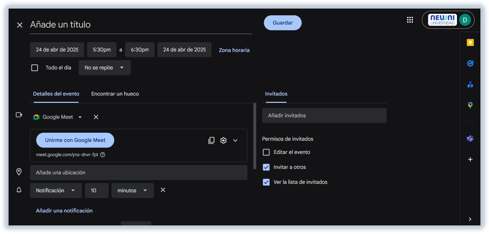
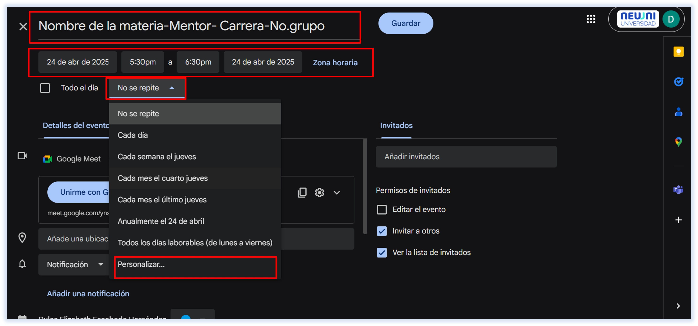
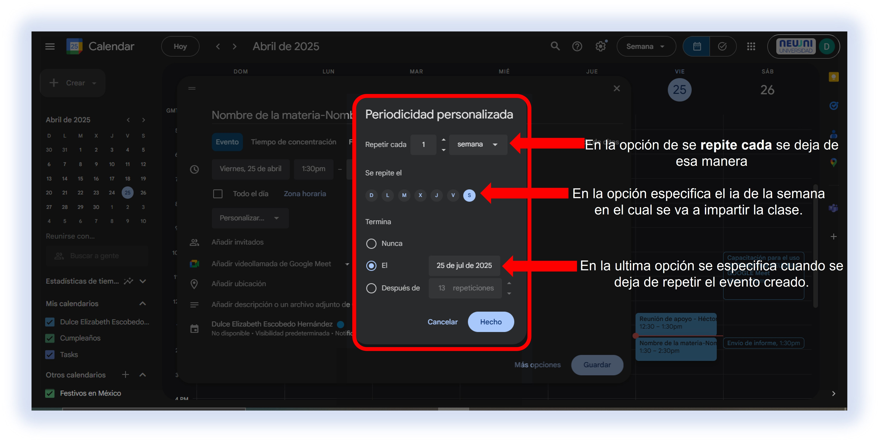
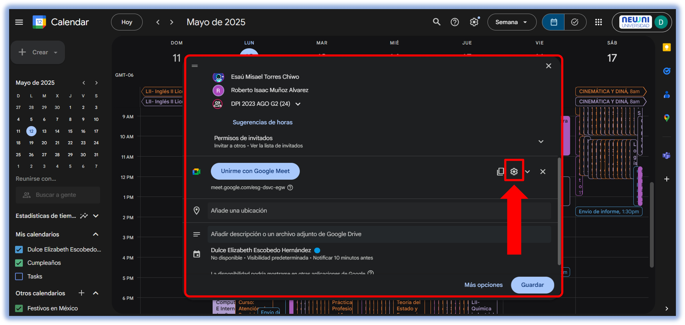
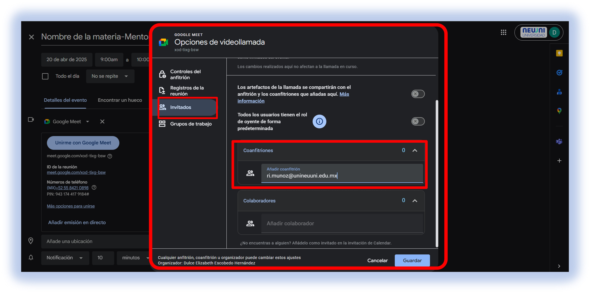
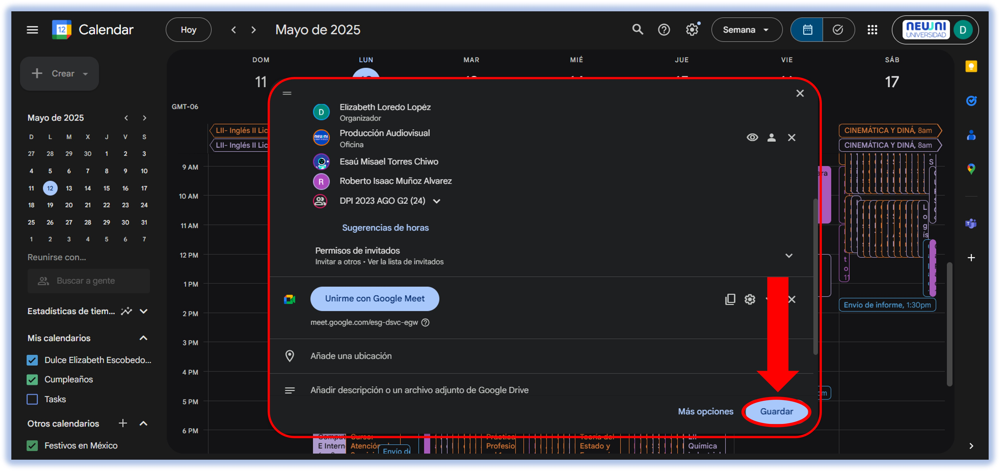

import VideoIntro from '@site/docs/tutorial-basics/insertarvideo.jsx';

# ¿Cómo crear una clase sincrónica?

## 1. Dirígete a Google Meet.

Dirígete a [Meet](https://meet.google.com) y selecciona "Nueva reunión".

Selecciona "Programar en Google Calendar".

Se abrirá una nueva pestaña donde podrás definir todos los aspectos técnicos de tu
clase.

En la visualización anterior, se debe completar de la siguiente manera:

Desde el primer punto de información, se debe llenar como aparece en la imagen, colocando los siguientes datos:

- **Nombre de la materia.**
- **Nombre del mentor.**
- **Carrera.**
- **Número de grupo.**

Una vez que se hayan ingresado estos datos, debemos especificar la hora de clase en la cual se va a llevar a cabo. Seleccionamos la opción "No se repite", tal como se muestra en la imagen. Al seleccionar esa opción, se desplegará una lista con la opción de **personalizar**. Una vez identificada esta opción, damos clic.

Al seleccionar la opción de personalizar, nos enviará a la siguiente ventana donde podremos especificar los siguientes datos de la llamada.

## 2. Añadir invitados.

Es fundamental incluir los siguientes correos electrónicos al momento de crear el evento, ya que corresponden al equipo de la universidad responsable de garantizar el correcto desarrollo de la clase:

**Coordinación:** Este contacto debe ser agregado, ya que es el encargado de monitorear la sesión y estar atento a cualquier problema que pueda surgir durante el transcurso de la clase, proporcionando apoyo inmediato en caso de inconvenientes.
**El correo de coordinación depende del área de la carrera.**
<table>
  <tr>
    <th>**Área académica**</th>
    <th>Licenciatura</th>
    <th>Maestría</th>
    <th>Ingeniería</th>
    <th>Doctorado</th>
  </tr>
  <tr>
    <td>**Correos**</td>
    <td>g.canseco@unineuuni.edu.mx</td>
    <td>rs.cortessanchez@unineuuni.edu.mx</td>
    <td>ri.munoz@unineuuni.edu.mx</td>
    <td>sc.valerio@unineuuni.edu.mx</td>
  </tr>
</table>

**Encargado de contenido:** Es imprescindible incluir este correo, pues esta persona se encarga de la edición de las clases grabadas y de su posterior publicación en la plataforma educativa, asegurando que el material quede correctamente gestionado y accesible para los estudiantes.
**em.torres@unineuuni.edu.mx**

**Departamento de contenido:** El correo del departamento de contenido se agrega a nuestro evento, y las clases se editan conforme se van grabando. Esto permite que los estudiantes puedan visualizar el contenido de su clase en el momento que lo deseen. Por esta razón, se implementa el correo del departamento de contenido en cada clase síncrona. 

**contenido@unineuuni.edu.mx**

**Correo de grupos:** Añadir el correo de cada grupo es una implementación que facilita a los estudiantes el acceso al enlace de la reunión de manera más sencilla, ingresando directamente desde su correo institucional.

## 4. Añadir coanfitrión.

Una vez realizado el proceso anterior, debemos ingresar el correo del coordinador de carrera como coanfitrión, dirigiéndonos a la opción de ajustes ⚙, como se muestra en la imagen.

Una vez seleccionada la opción anterior, se nos dirigirá a la siguiente pantalla, donde debemos ubicarnos en la sección de invitados y colocar el correo de coordinación encargado de la carrera en la que se está ingresando. Al finalizar la edición del evento, seleccionamos la opción de "Guardar".

Una vez finalizada la calendarización del evento, damos clic en **"guardar"**.

