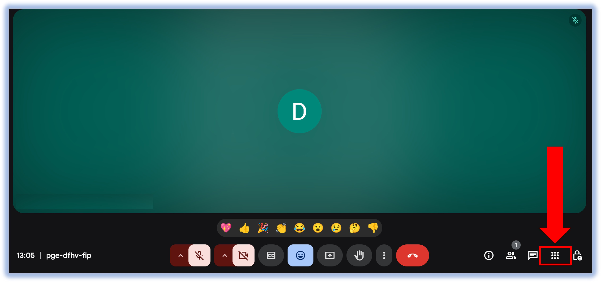
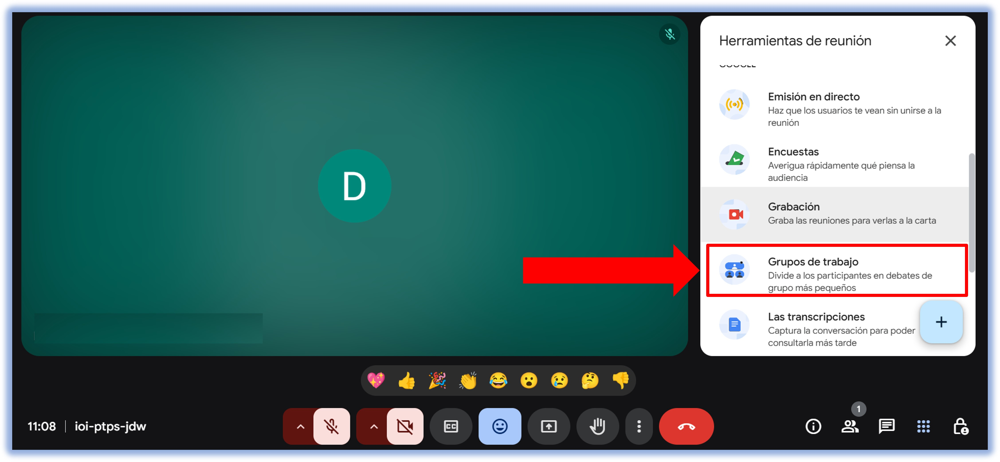
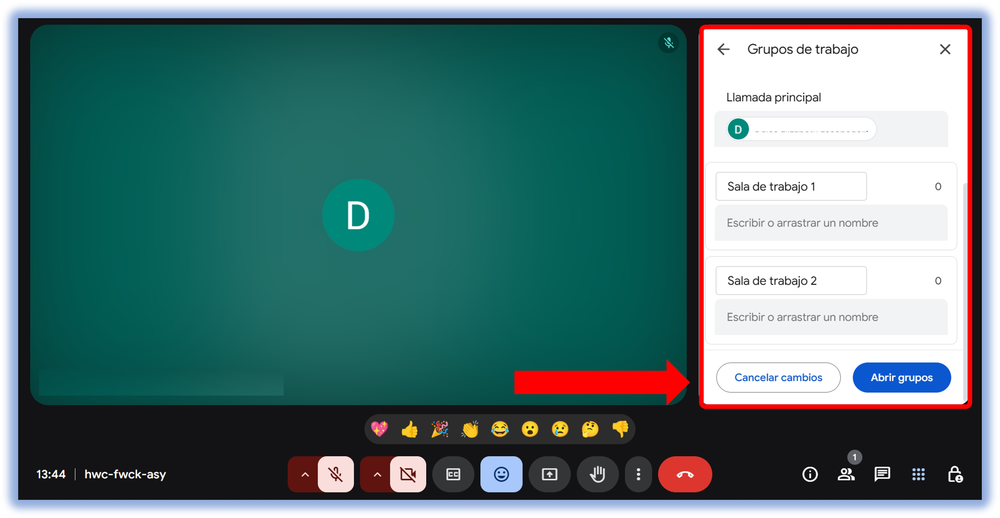
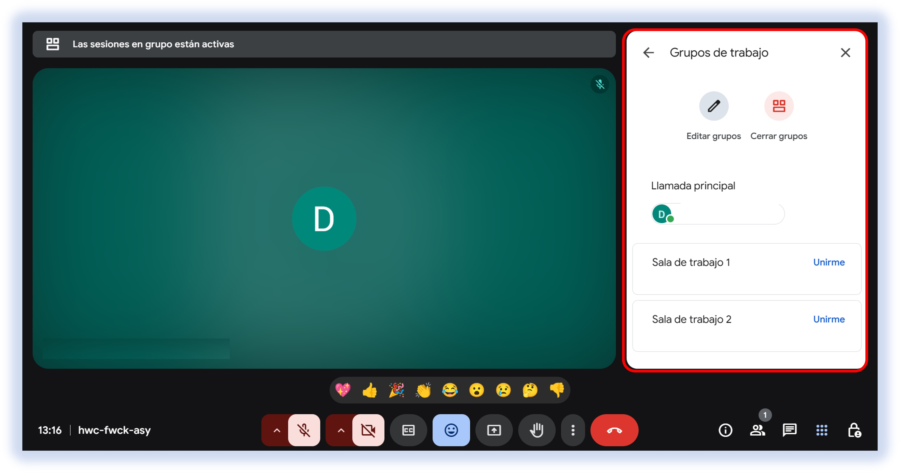

import VideoIntro from '@site/docs/tutorial-basics/insertarvideo.jsx';

# ¿Cómo crear grupos de tabajo?

## 1.Abre tu clase sincrónica en plataforma Meet.

Dirígete a la opción señalada en la imagen; al hacer clic, aparecerá la siguiente pantalla:

Haz clic en esa opción para acceder a la visualización siguiente:

## 2. Configuración de salas.

- Decide cuántas salas de grupos deseas crear.

- Asigna a los participantes de forma manual o permite que Google Meet los distribuya automáticamente.

- Opcionalmente, puedes renombrar las salas según la tarea o el equipo asignado.

- También tienes la opción de agregar un temporizador, especificando cuánto tiempo permanecerán abiertas las salas de trabajo.

Una vez que hayas configurado las salas de trabajo, desliza hacia abajo la barra de opciones hasta encontrar las siguientes funciones. Para finalizar la configuración, da clic en **"Abrir grupos"**.

Cuando los grupos de trabajo estén abiertos, podrás observar las siguientes opciones, donde es posible modificar el tiempo y reubicar a los participantes durante la reunión.

