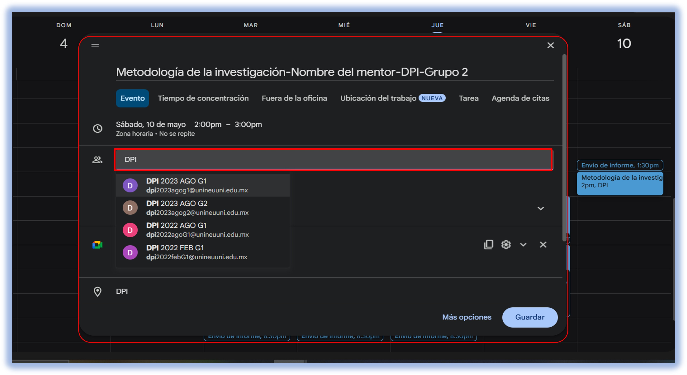
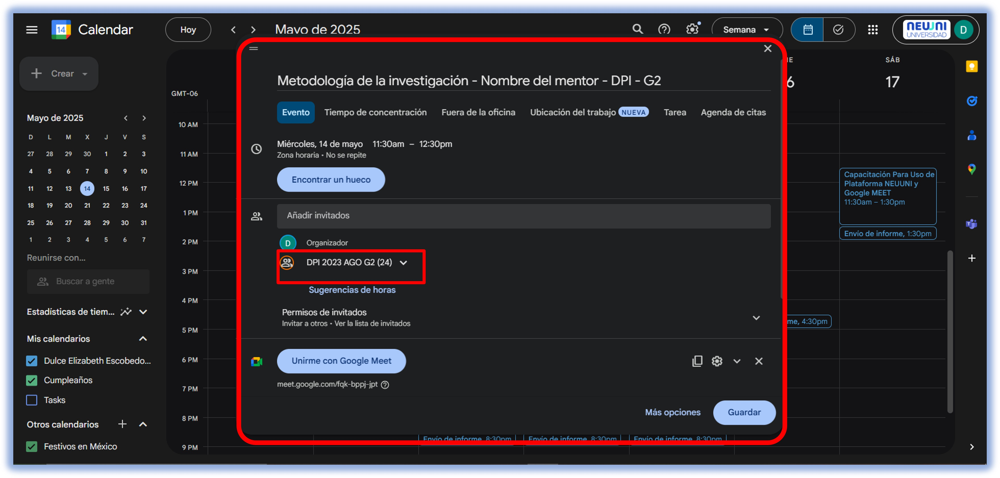

import VideoIntro from '@site/docs/tutorial-basics/insertarvideo.jsx';

# ¿Cómo agregar grupos de estuadiantes?

¡Hola, queridos mentores! 😊

A través de este tutorial, les brindaremos una explicación detallada sobre cómo pueden añadir el correo del grupo en su evento de Google Meet. Esta práctica se implementa para garantizar que los alumnos tengan un acceso más seguro y 
organizado a cada clase dentro de la plataforma Meet.

 ### Paso 1: Acceder al evento.

Ingresamos a nuestro evento previamente creado, ya sea editándolo o al momento de crearlo. En la ventana de configuración del evento, nos ubicamos en la opción de Invitados, donde podremos agregar los correos electrónicos de los grupos.

### Paso 2: Buscar y agregar el correo del grupo.

En el campo de invitados, escribimos las siglas de la carrera a la que pertenece el grupo, como se muestra en la imagen de referencia. Esto nos permitirá realizar una búsqueda rápida y precisa del correo correspondiente. Una vez identificado el grupo adecuado, lo seleccionamos.

### Paso 3: Verificar la lista de alumnos

Después de seleccionar el correo del grupo, este aparecerá en la parte inferior junto con nuestro correo institucional. Al dar un segundo clic en el correo agregado o colocar el cursor sobre el correo, se desplegará la lista completa de los alumnos que forman parte de ese grupo, asegurando que todos recibirán la notificación del evento creado.

### Paso 4: Guardar los cambios.

Una vez realizado este procedimiento y verificado que el correo se ha agregado correctamente, damos clic en la opción de Guardar para que los cambios queden registrados.

