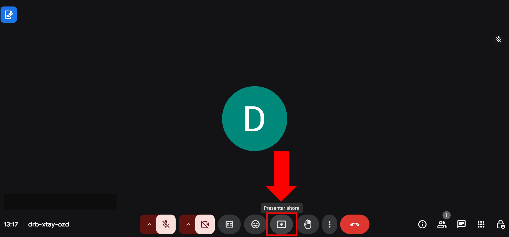
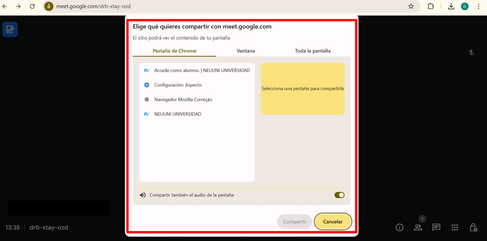
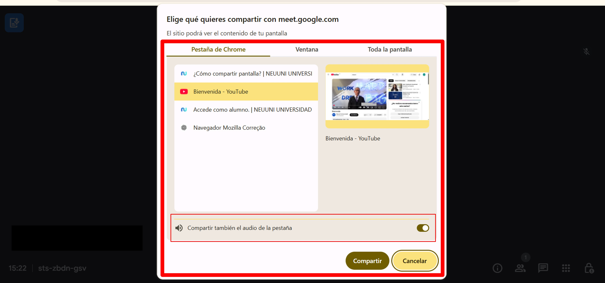
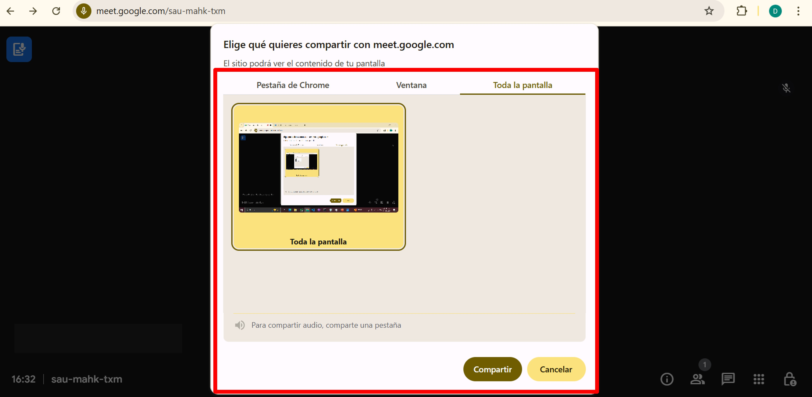
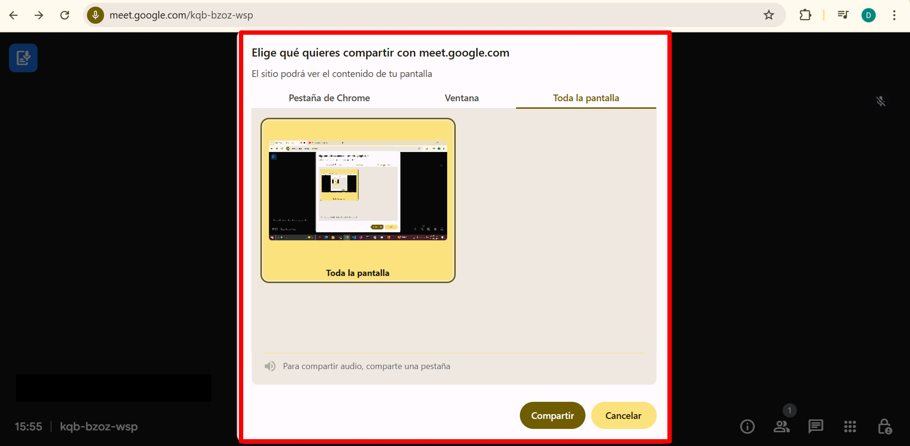
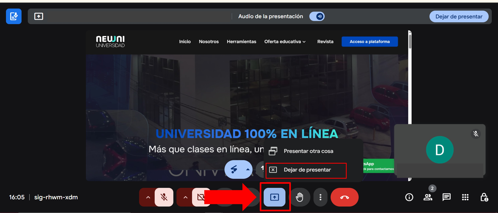

# ¿Cómo compartir pantalla?

## 1. Abre tu navegador y ingresa a tu reunión.

En la parte inferior de la pantalla, haz clic en el botón "Presentar ahora".

## 2.Opciones para compartir pantalla

- Tu pantalla completa: Comparte todo lo que aparece en tu monitor.

- Una ventana: Comparte una ventana específica de las que tienes abiertas.

- Una pestaña: Comparte una pestaña de tu navegador (ideal para compartir contenido con audio).

### Durante la reunión

Selecciona la opción que prefieras (pantalla completa, ventana o pestaña).
    
Abre el video antes de compartir: Asegúrate de tener abierta la pestaña con el video que deseas compartir (por ejemplo, un video de YouTube).

Haz clic en "Presentar ahora" y selecciona la pestaña que se quiere compartir.

Aparecerá una ventana emergente con todas las pestañas abiertas en tu navegador. Selecciona la pestaña que contiene el video.

Activa la opción de compartir audio: Marca la casilla "Compartir audio" en la esquina inferior izquierda de la ventana emergente normalmennte esta opciónse tiene activa automaticamente. 

Haz clic en "Compartir". Ahora, los participantes podrán ver el video y escuchar el audio

**Ventana**

Selecciona esta opción si deseas compartir una ventana específica de las que tienes abiertas.

Aparecerá una lista con las ventanas disponibles. Elige la ventana que deseas compartir y haz clic en "Compartir".

**Pantalla completa**

Selecciona esta opción si deseas compartir todo lo que aparece en tu monitor.

Aparecerá una ventana emergente solicitando permiso para compartir tu pantalla. Selecciona la pantalla que deseas compartir y haz clic en "Compartir".

Ideal para mostrar múltiples aplicaciones o ventanas abiertas.

## Dejar de compartir

Para dejar de compartir, haz clic en el botón "Dejar de presentar" que aparece en la parte inferior de la pantalla.

