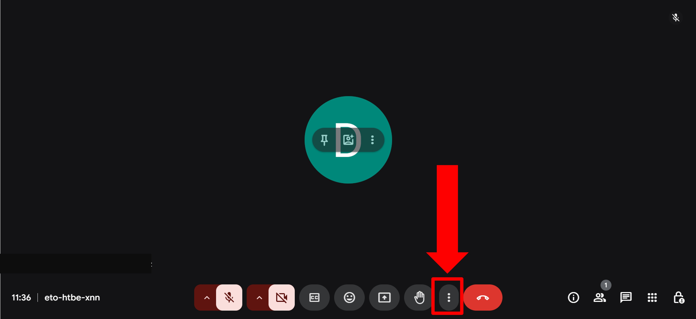
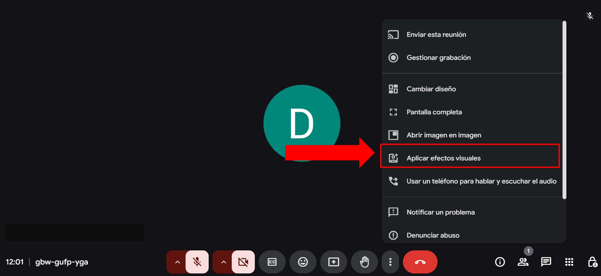
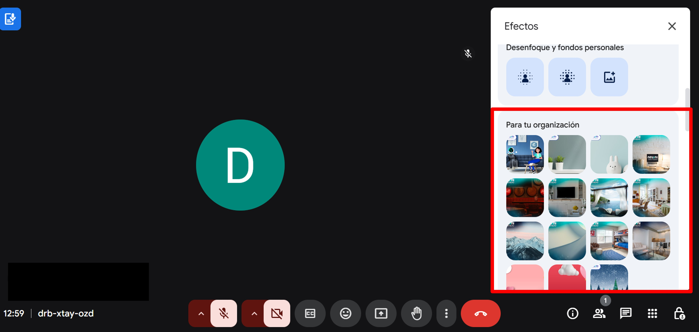

# Fondo en google meet. 

## 1. Abre la aplicación de Meet y selecciona una reunión. 

Recuerda iniciar con correo institucional a tu reunión de Meet si tienes dudas de como inicar secciona ve a la la seccion de [Correo Institucional]

## 2.Ubicamos la opción de efectos visuales.

En la pantalla de vista previa, busca el ícono de "Efectos visuales" (generalmente representado por una varita mágica o tres puntos).

## 3.Elige algún fondo. 

