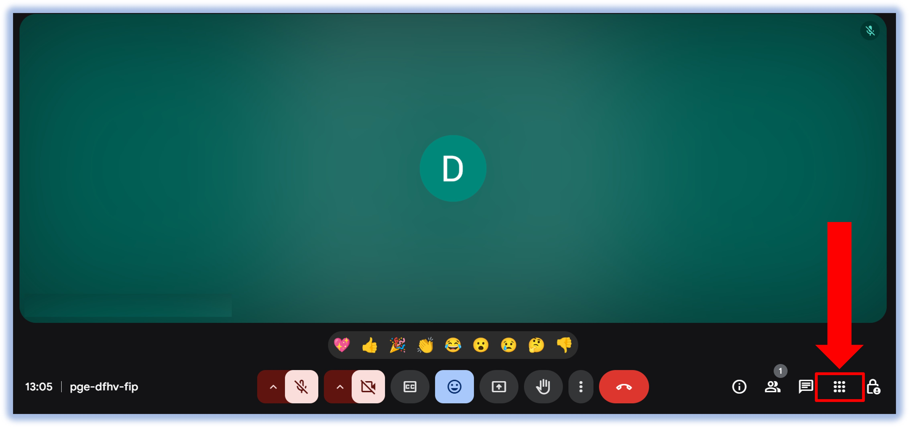
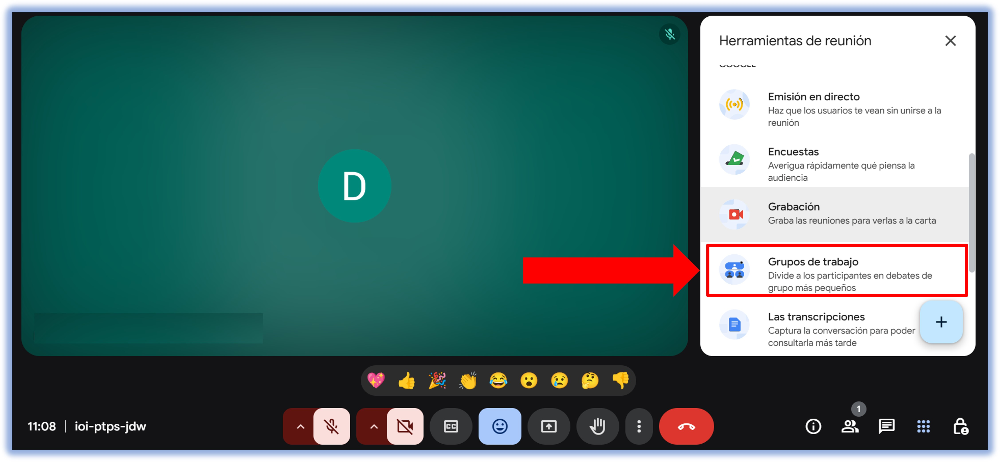
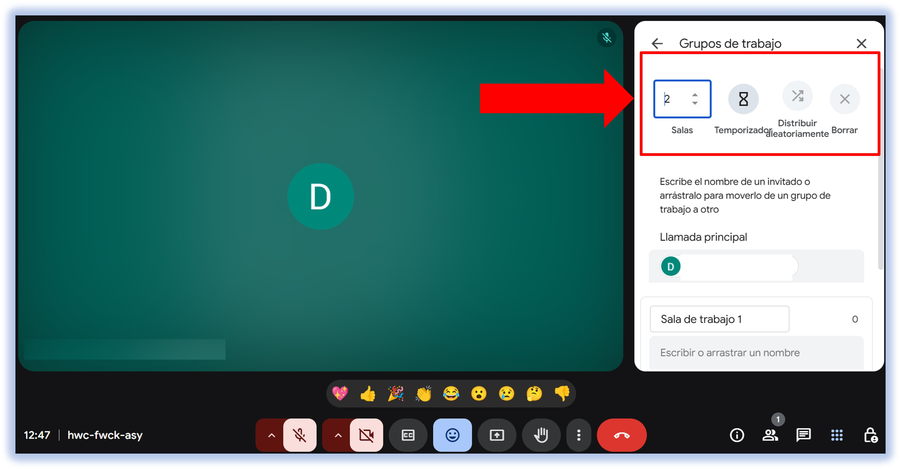
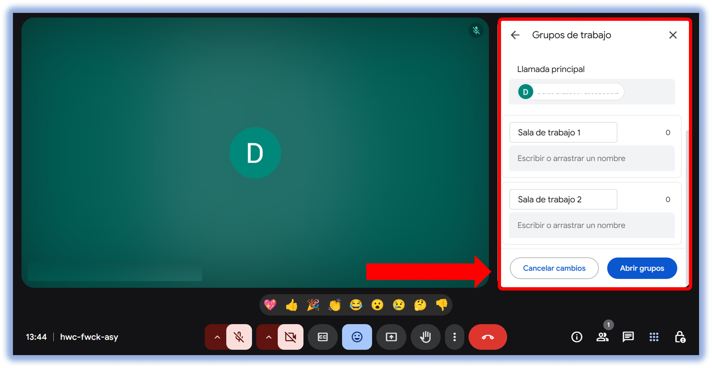
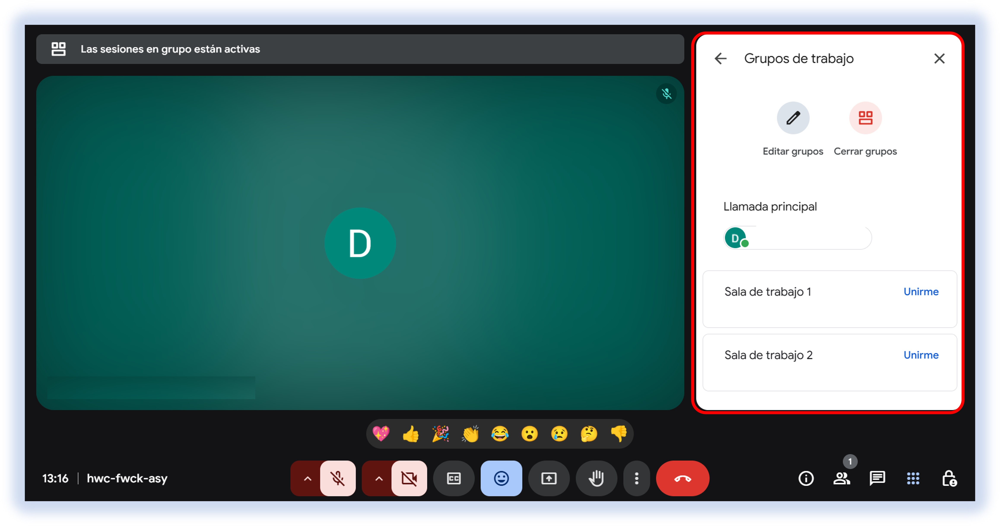

import VideoIntro from '@site/docs/tutorial-basics/insertarvideo.jsx';

# 👥 Crear grupos de trabajo

Divide a tus alumnos en **grupos de trabajo** durante la clase. Esto permitirá dividir
a los alumnos para la elaboración de la primer parte de la actividad.

Aprende a realizar este proceso correctamente siguiendo los paso que a continuación se enlistan.

## 1. Abre tu clase sincrónica en plataforma Meet

1. Dentro de la llamada de Meet, haz clic en **Herramientas de reunión**, ubicada en la parte
inferior derecha.

2. En la ventana, haz clic en **Grupos de trabajo**.

## 2. Configuración de Grupos

1. Realiza los siguientes ajustes para configurar los grupos de trabajo:

    - **Número de grupos.** Según las instrucciones de la actividad y el número de alumnos disponibles en clase,
    elige el número adecuado.

    - **Temporizador.** Ajusta el número de minutos que estarán abiertas las salas. El ajuste predeterminado son 25 minutos,
    pero puedes elegir hasta 30 min según la actividad y la disponibilidad de tiempo que tengas.
    
    No te preocupes por la distribución de los alumnos, ¡Google Meet hace el trabajo pesado por nosotros!

#### *NOTA: La distribución de los alumnos siempre será de manera aleatoria.*

2. Una vez configuradas las salas, **Abre los grupos** de trabajo. Desliza hacia abajo la barra de opciones hasta encontrar
el botón correspondiente.

Cuando los grupos de trabajo están abiertos, podrás observar estas opciones.
 - **Editar grupos.** Desde aquí podrás configurar los grupos de trabajo ya hechos, cambiando a alumnos de lugar o reasignando
 a aquellos que se quedaron fuera. No olvides guardar los cambios después de mover a los alumnos.
 - **Cerrar grupos.** Puedes cerrar los grupos de trabajo una vez transcurrido el tiempo completo (en caso de que hayas
 configurado el tiempo erróneamente o no lo hayas hecho).

También puedes **cambiarte entre los Grupos de Trabajo**. En la ventana derecha, al lado del nombre del grupo aparece, en color
azul, el botón **Unirme**. Desde ahí podras entrar y salir de los distintos grupos, muy importante para monitorear a los alumnos.

*Implementar esta función de manera efectiva no solo replica la interacción de un aula o sala de reuniones física, sino que la optimiza, ofreciendo flexibilidad y eficiencia. En un mundo cada vez más digitalizado, dominar el uso de los grupos de trabajo en Google Meet es clave para maximizar la productividad y la conexión humana, asegurando que cada sesión virtual sea más interactiva, productiva y enriquecedora para todos los involucrados.* 🤝