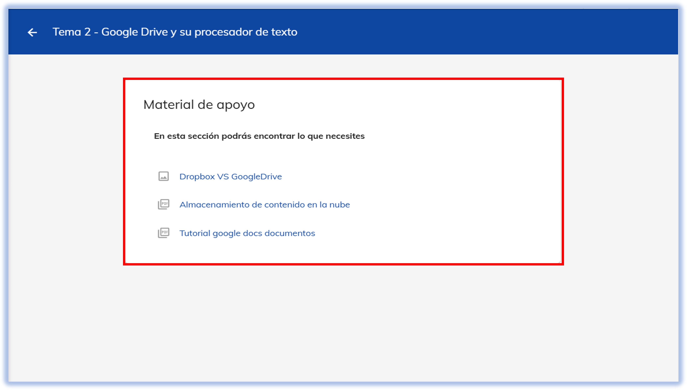

import CustomLink from '@site/docs/tutorial-basics/CustomLink.jsx'

# 💡 Material de Apoyo

## Conoce el material extra que tenemos para ti

Ubica los archivos de apoyo que complementan las clases sincrónicas y las clases virtuales.

### 1. Acceso a la plataforma
1. Ingresa a [NEUUNI](https://unineuuni.edu.mx/). Selecciona la materia y número de tema que corresponde.
2. ¿Problemas para acceder? Consulta nuestro <CustomLink href="../Primeros pasos/firstelements.html">tutorial de ingreso</CustomLink>. una ves dentro de plataforma ingresa al tema que se quiere consultar, damos seleccion al modulo de material de apoyo.

### 2. Explora el módulo

Revisa los recursos disponibles (artículos, presentaciones, videos, etc.) que te apoyarán en la comprensión del tema que estés viendo en tu materia. No es obligatoria
su consulta, pero sirve como un buen recurso adicional.

**NOTA: Si tienes algún documento adicional que pueda complementar este módulo, envíalo al Coordinador para que puedan agregarlo.**

*El material de apoyo en NEUUNI es una herramienta valiosa y complementaria para tus clases. Aunque no es obligatorio, te animamos a explorar los recursos disponibles en la plataforma para enriquecer tu aprendizaje y profundizar en cada tema. ¡Aprovecha al máximo este recurso adicional!* ✨