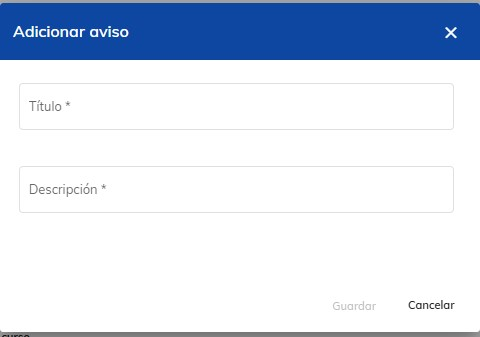
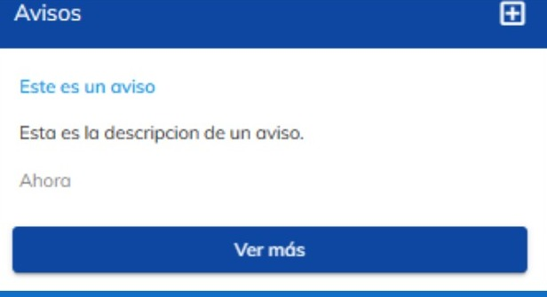
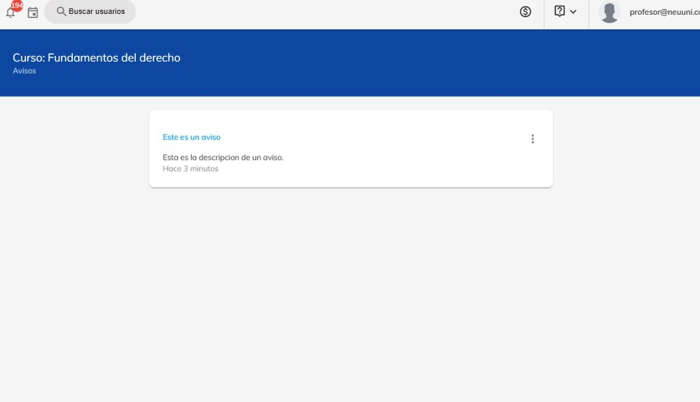
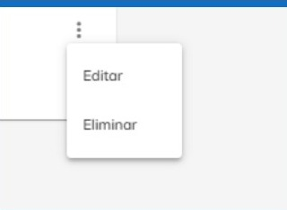

import CustomLink from '@site/docs/tutorial-basics/CustomLink.jsx'

# 📝 Creación y gestión de avisos

## Gestiona los avisos dentro de los cursos de NEUUNI

### 1. Acceso a la plataforma
1. Ingresa a [NEUUNI](https://unineuuni.edu.mx/) y accede a la materia correspondiente.
2. ¿Problemas para acceder? Consulta nuestro <CustomLink href="../Primeros pasos/firstelements.html">tutorial de ingreso</CustomLink>.

### 2. Gestión y configuración de avisos
1. En la sección **Mis cursos**, elige el curso en el que deseas subir el aviso.
2. En el panel derecho, localiza el apartado de **Avisos**.

### 3. Crear un nuevo aviso
1. Haz clic en el botón **+** en la sección de Avisos.
2. Completa los campos requeridos de la configuración del aviso:
 - Título del aviso.
 - Descripción detallada.
3. Presiona **Guardar** para aplicar los cambios y subir el aviso.

## Visualiza todos los avisos
Para poder **ver los avisos configurados**, sigue los siguientes pasos:

1. Haz clic en **Ver más** para mostrar el listado completo de avisos.
2. Todos los avisos aparecerán según se fueron configurando.

## Edita o elimina avisos
Se pueden **editar o eliminar** los avisos configurados para una mejor gestión.
Para poder editar/eliminar un aviso, sigue los siguientes pasos:

1. Haz clic en los **tres puntos verticales (⋮)**.
2. Selecciona según sea el caso:
 - **Editar**: Modifica el título y la descripción.
 - **Eliminar**: Confirma la acción de eliminar el aviso.

*Ahora puedes crear, editar y gestionar avisos en NEUUNI con confianza. ¡Comunica información 
importante a tus estudiantes eficientemente!*

*¿Necesitas más ayuda? Contacta al equipo de Soporte Técnico en caso de cualquier duda*. 🚀