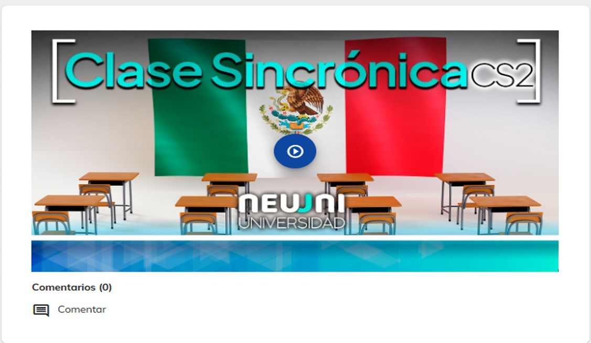
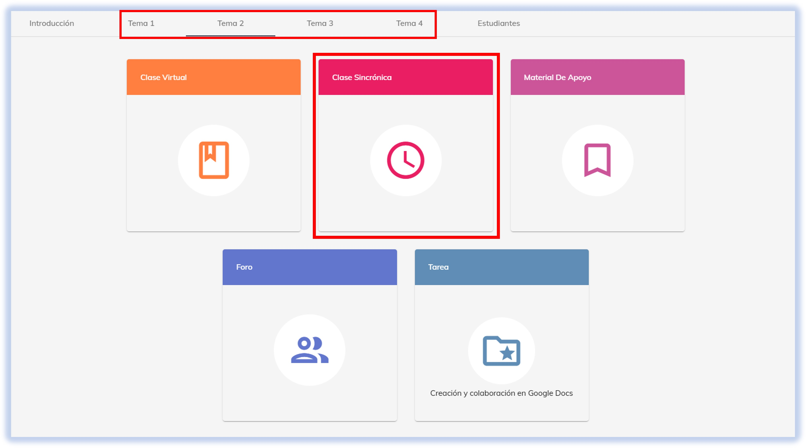
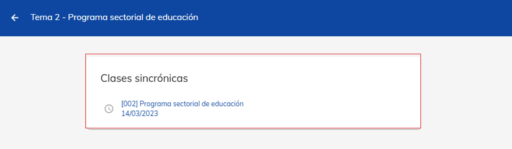
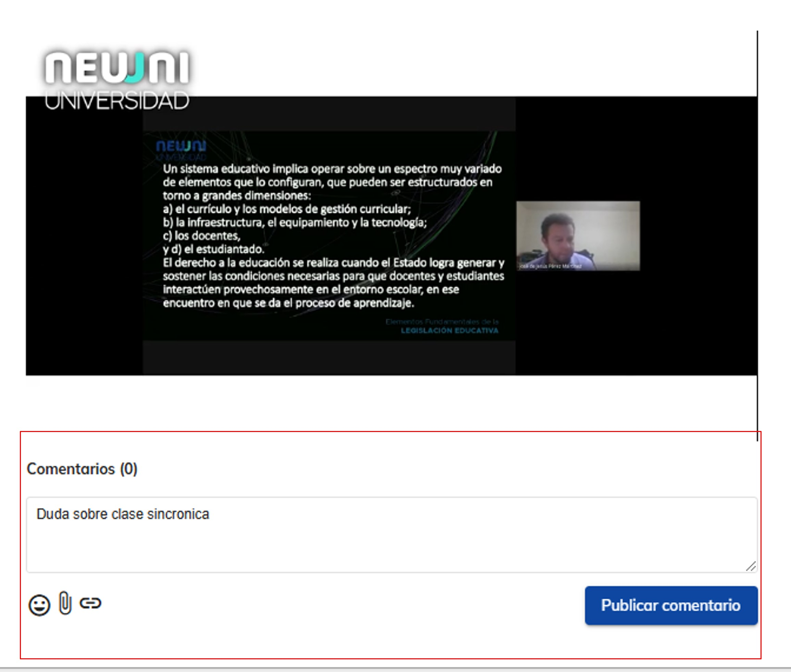

import CustomLink from '@site/docs/tutorial-basics/CustomLink.jsx'

# 📹 Clase sincrónica

## Visualiza la grabación de tu clase

En este apartado se carga la clase previamente impartida, 

El objetivo de este módulo es que el alumno pueda repasar o reponer alguna clase a la que no haya podido acceder. La grabación de la clase está
disponible en la plataforma en el transcurso del día siguiente hábil.

***¿Cómo puedo acceder a las clases sincrónicas grabadas de los cursos?***

### 1. Acceso a la plataforma

1. Ingresa a [NEUUNI](https://unineuuni.edu.mx/)
2. ¿Dudas de como acceder? Consulta nuestro <CustomLink href="../Primeros pasos/ingreso-plataforma.html">tutorial de acceso</CustomLink>. 

### 2. Ingreso al módulo de clase sincrónica

1. Accede al módulo de **Clase sincrónica** desde la materia y el número de tema que desees.

### 3. Contenido de la clase sincrónica

Dentro de este módulo, se encontrará la grabación de la clase sincrónica. El acceso a la grabación de la clase te
permite repasar el contenido, recuperar algo que te perdiste o ver la clase si no pudiste estar ahí. Recuerda 
que la grabación está disponible un día hábil después del día de tu clase y podrás verla 24/7. 

## Neuuni Connect 🌀

Dentro de cada uno de los videos de la plataforma está incorporada la herramienta **NEUUNI Connect**, que nos permite
realizar comentarios en intervalos específicos del video. Es de gran apoyo para puntualizar las dudas en las partes
exactas del video.

Para dejar tu comentario en cierto intervalo de tiempo, simplemente **pausa el video y haz el comentario** que deseas realizar,
y quedará guardado en esa posición.

*Las clases sincrónicas grabadas en NEUUNI son una herramienta fundamental para tu aprendizaje. Te brindan la flexibilidad de repasar el contenido a tu propio ritmo, ponerte al día si te perdiste una sesión, o simplemente reforzar lo aprendido. Con acceso 24/7 y la útil herramienta Neuuni Connect para comentarios contextuales, tienes todo lo necesario para aprovechar al máximo cada clase y asegurar tu comprensión de los temas. ¡Aprovecha esta valiosa funcionalidad para potenciar tu éxito académico!* 🔝👩‍🎓🧑‍🎓