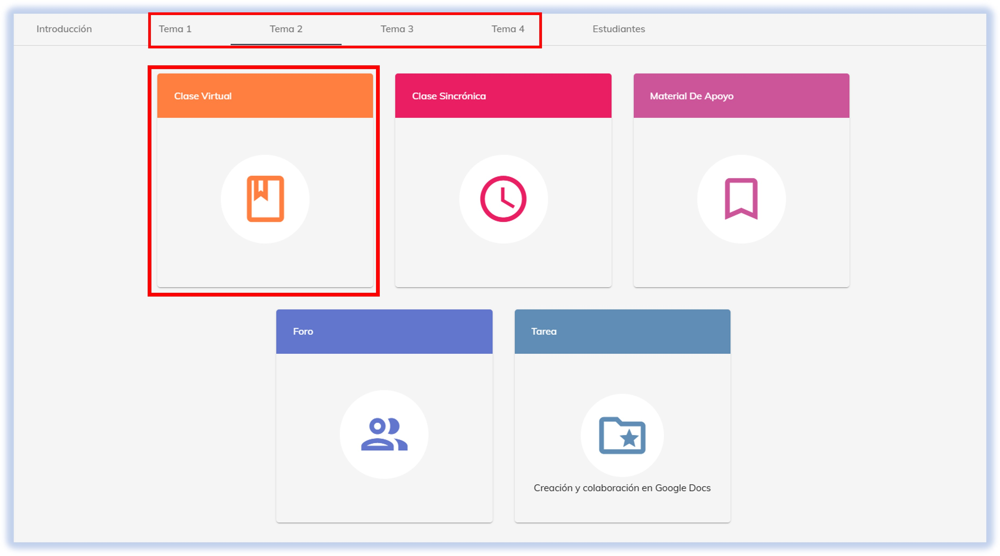
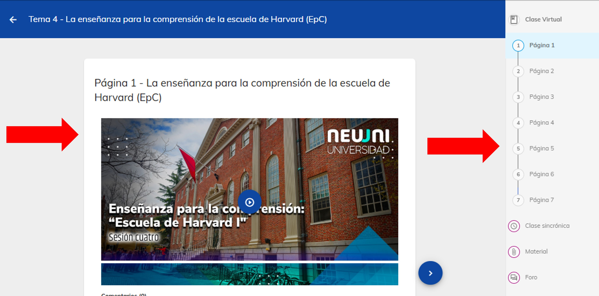
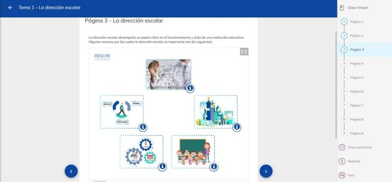
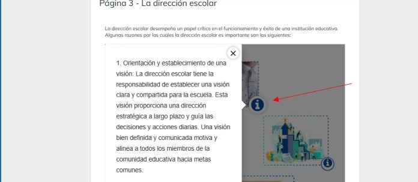
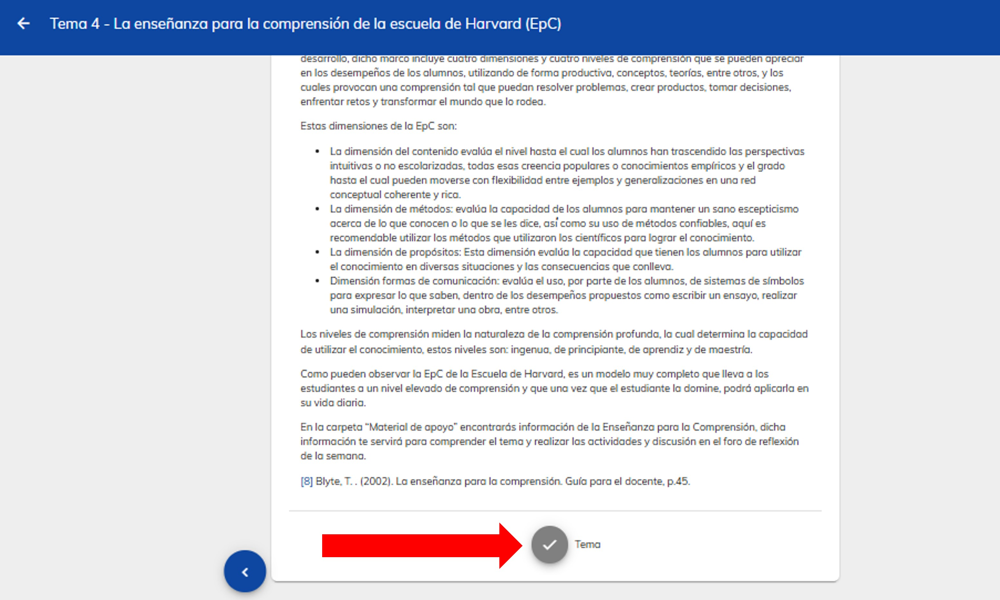

import CustomLink from '@site/docs/tutorial-basics/CustomLink.jsx'

# 📓 Clase virtual

## Descubre el contenido de la clase virtual

La clase virtual **es el módulo más importante para un estudiante en NEUUNI**, ya que a través de este módulo, el alumno obtiene
la información relacionada con el contenido de la clase. El objetivo es una lectura activa, aplicando las técnicas de estudio
que posea el alumno, complementando con imágenes, videos y actividades de gamificación que van a apoyar la comprensión del tema. 🧠

En conjunto con la clase sincrónica, estos dos elementos son los pilares fundamentales para realizar la actividad exitosamente.

### 1. Acceso a la plataforma

- Ingresa a [NEUUNI](https://unineuuni.edu.mx/) y elige la materia y el número de tema que corresponde.
- 쯇roblemas para acceder? Consulta nuestro <CustomLink href="../Primeros pasos/firstelements.html">tutorial de ingreso</CustomLink>. una ves dentro de plataforma ingresa al tema que se quiere consultar, damos seleccion al modulo de material de apoyo.

### 2. Selecciona el módulo de clase virtual

En los 5 módulos disponibles, elige el de **Clase Virtual**, de color naranja.

### 3. Contenido de la clase virtual

Dentro de la sección, podrás observar el contenido principal del tema, el cual estará compuesto 
por texto, imágenes, videos y, en algunos casos, herramientas de gammificación que te ayudarán a reforzar
tu aprendizaje.

Durante el recorrido del tema, las **herramientas de gamificación** 
te permitirán evaluar y reforzar tu progreso. La clase virtual no se limita a texto, ya que incluye diversos 
formatos interactivos y métodos de aprendizaje diseñados para enriquecer tu experiencia.

Cada una de las páginas incluye una guía visual que guarda la última página que leíste, 
permitiéndote saber exactamente dónde continuar la próxima vez que ingreses al módulo.

Con estos sencillos pasos podrás estar revisando esta parte tan importante en el modelo de NEUUNI.
Recuerda tomarte tu tiempo para que revises activamente el contenido del módulo