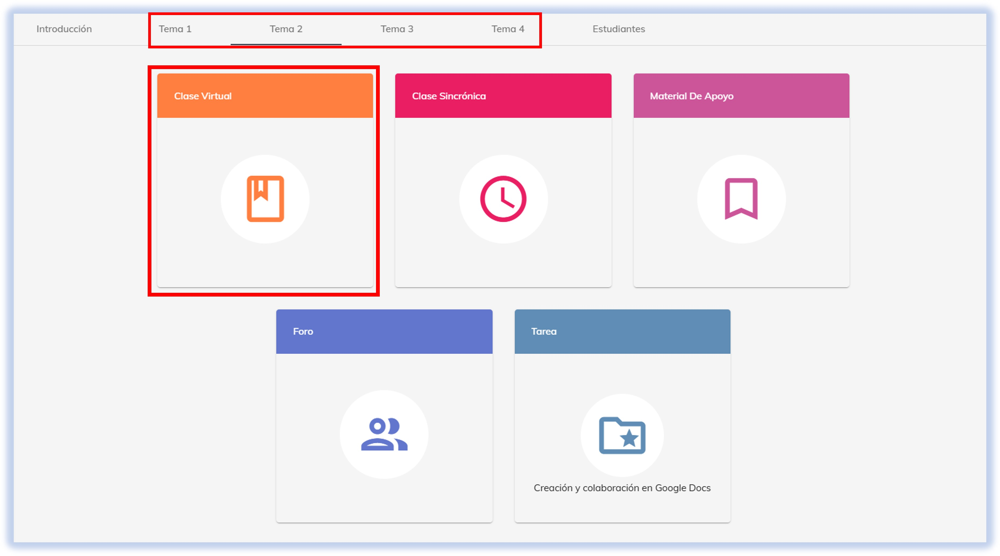
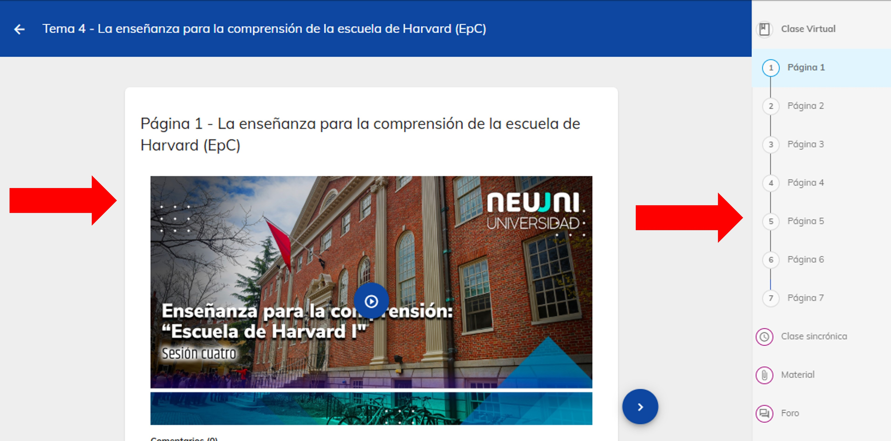
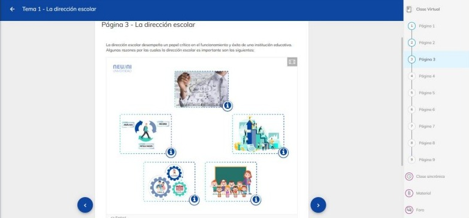
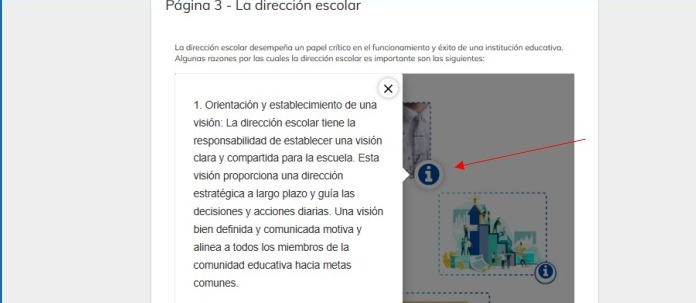
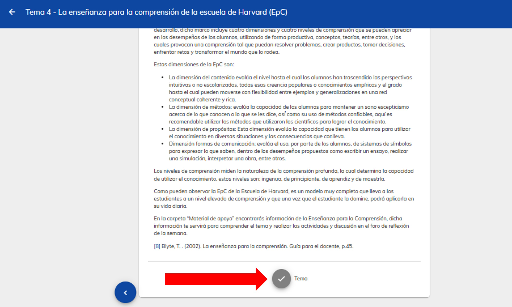

import CustomLink from '@site/docs/tutorial-basics/CustomLink.jsx'

# Clase virtual.

La clase virtual se constituye en una guía para el estudiante donde se orienta cómo y cuándo 
realizar una tarea, detenerse en el análisis de una imagen, analizar un artículo, observar y analizar un 
video o participar en un foro, por ejemplo.

## 1. Acceso a la plataforma

- Ingresa a [NEUUNI](https://unineuuni.edu.mx/)
- ¿Problemas para acceder? Consulta nuestro <CustomLink href="../Primeros pasos/firstelements.html">tutorial de ingreso</CustomLink>. una ves dentro de plataforma ingresa al tema que se quiere consultar, damos seleccion al modulo de material de apoyo.

## 2. Selecciona el módulo de clase virtual.

Selecciona el módulo de la Clase Virtual.

### 4. Contenido de la clase virtual

Dentro de la sección, podrás observar el contenido principal del tema, el cual estará compuesto 
por videos, textos y, en algunos casos, herramientas de gammificación que te ayudarán a reforzar
tu aprendizaje.

Durante el recorrido del tema, en las distintas páginas, podrás encontrar **herramientas de gamificación** que 
te permitirán evaluar y reforzar tu progreso. La clase virtual no se limita a texto, ya que incluye diversos 
formatos interactivos y métodos de aprendizaje diseñados para enriquecer tu experiencia.

Cada una de las páginas incluye una guía visual que guarda la última página que leíste, 
permitiéndote saber exactamente dónde continuar la próxima vez que ingreses al módulo.

