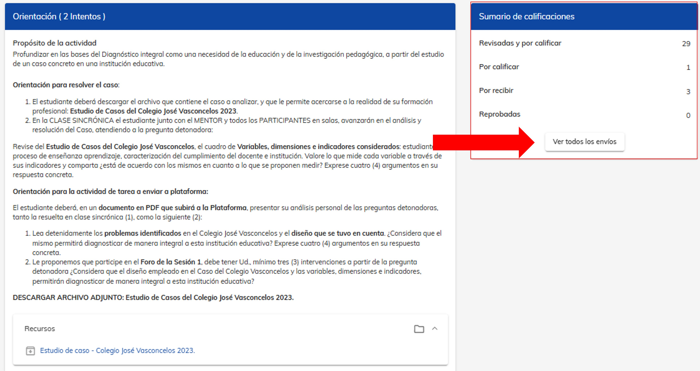
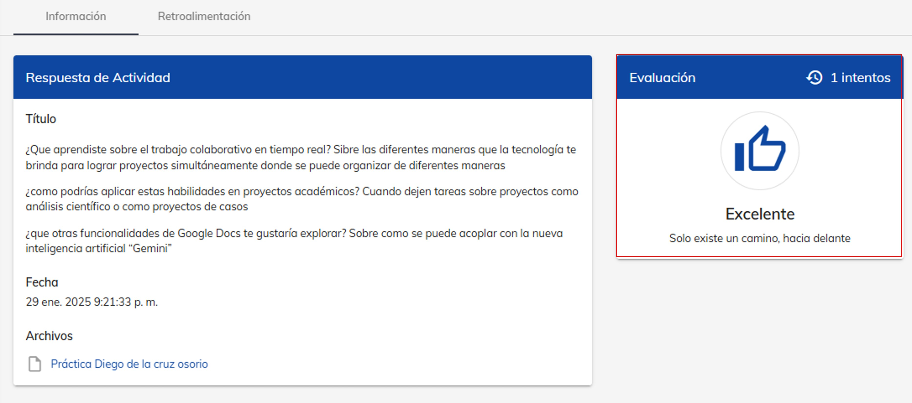

# Evaluación de actividad

## Sigue el proceso para calificar a tus alumnos

Uno de los aspectos clave como mentor en NEUUNI es realizar correctamente el proceso de evaluación y retroalimentación a los 
alumnos, por lo que en este espacio podrás revisar el proceso para evaluar una actividad.
No olvides complementar la evaluación con una **retroalimentación correcta**, para
ayudar a los alumnos a saber sus áreas de mejora. ✍⬆

Para evaluar la actividad, sigue las indicaciones a continuación:

### 1. Ingresa al módulo de tarea. 

Drígete el módulo de **Tarea** de la actividad a evaluar.
En la sección **Sumario de calificaciones**, selecciona **Ver todos los envíos**. 

### 2. ¿Como calificar?

Utiliza la opción **"Por calificar"** para filtrar los alumnos pendientes de evaluación. 
Selecciona el ícono de **diálogo** (ubicado a la derecha del envío) para acceder al envío de la actividad. 

Dentro del envío de la actividad del alumno, podrás identificar la información de la respuesta de actividad,
 entre ellos, **la fecha y hora y el archivo subido**. 
Para descargar el documento, haz doble clic sobre el nombre del archivo, que aparece en letras azules. 
Puede que se descargue el archivo en el navegador o se abra una pestaña nueva, dependiendo la configuración
del navegador y el archivo, entre otros factores.

Una vez que hayas revisado el archivo y definas tu veredicto, podrás **abrir la ventana 
de calificación de la actividad**. Para ello, haz clic en el **ícono de diálogo** ubicado en la 
sección de Evaluación.

En la **ventana de Evaluación**, selecciona, según sea el caso, **la calificación Satisfactoria o 
Insatisfactoria**. Luego, **elige una frase motivacional** de las opciones disponibles. 

En la sección de **Retroalimentación**, incluye los comentarios correspondientes a la 
actividad del alumno. Asegúrate de que tus observaciones sean claras, constructivas y 
alineadas con los objetivos de la actividad. 

Una vez que hayas completado todos los campos correctamente, haz clic en **Guardar**. 
Para confirmar que la evaluación se realizó correctamente, **verifica que el ícono en la 
sección de Evaluación haya cambiado**, mostrando la calificación asignada y la frase 
motivacional que seleccionaste. 

¡Y listo! De esta manera podrás ir calificando cada una de las actividades de tus alumnos.
No olvides consultar nuestro artículo de **Cómo realizar una retroalimentación correcta** (poner link)