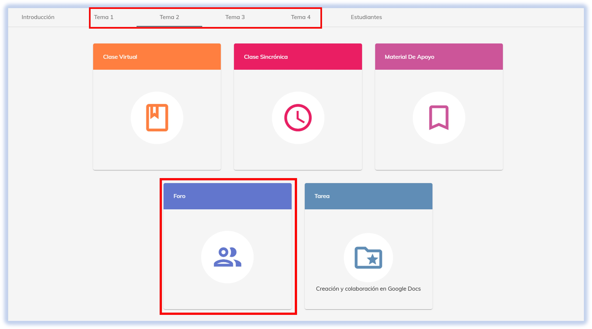
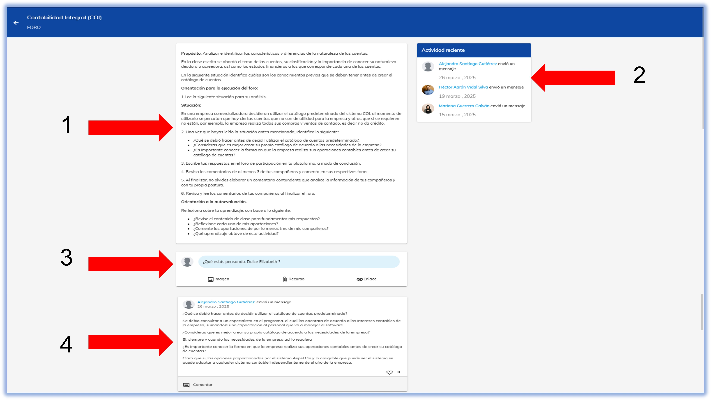

import CustomLink from '@site/docs/tutorial-basics/CustomLink.jsx'

# 👥 Foro

## Comparte tus opiniones y participa en NEUUNI.

Este espacio esencial está diseñado para enriquecer el aprendizaje.
El objetivo es la particiáción activa en la discusiones.✍

Sigue a continuación los pasos para saber cómo ingresar a la plataforma.

### 1. Acceso a la plataforma

1. Ingresa a [NEUUNI Universidad](https://unineuuni.edu.mx/) y selecciona la materia y número de tema correspondiente.
2. ¿Dudas de cómo acceder? Consulta nuestro <CustomLink href="../Primeros pasos/ingreso-plataforma.html">tutorial de acceso a plataforma</CustomLink>.

### 2. Elementos del módulo de foro
Al entrar al foro, podrás observar los siguientes elementos:

1. Un **apartado informativo** sobre el apartado seleccionado. Aquí se muestra, a modo de caso, el tema sobre el que se trabajará este módulo, seguido de
las **preguntas detonadoras**, que sirven como guía para desarrollar tu participación.
2. Un **espacio que muestra la actividad reciente de los participantes** que han comentado en el foro.
3. La **sección donde podrás compartir tu opinión** mediante texto, imágenes, enlaces o incluso subiendo documentos.
4. Las **participaciones de otros usuarios**. Aquí podrás interactuar, ya sea comentando o dando "me gusta" a las participaciones de tus compañeros.

## ¿Cuál es la participación del mentor en el foro?

El mentor juega un papel fundamental de mantener la discusión activa y fomentar la respuesta 
de los alumnos, animándolos a participar y guiándolos de acuerdo al objeto de discusión. 👩‍🏫👨‍🏫

*En definitiva, el foro virtual es mucho más que un simple espacio de comentarios; es un elemento importante en el aprendizaje que permite interactuar,
reflexionar y construir conocimiento de forma colaborativa. Aprovechar al máximo esta herramienta significa enriquecer la perspectiva, resolver dudas y 
consolidar lo aprendido en cada módulo.*