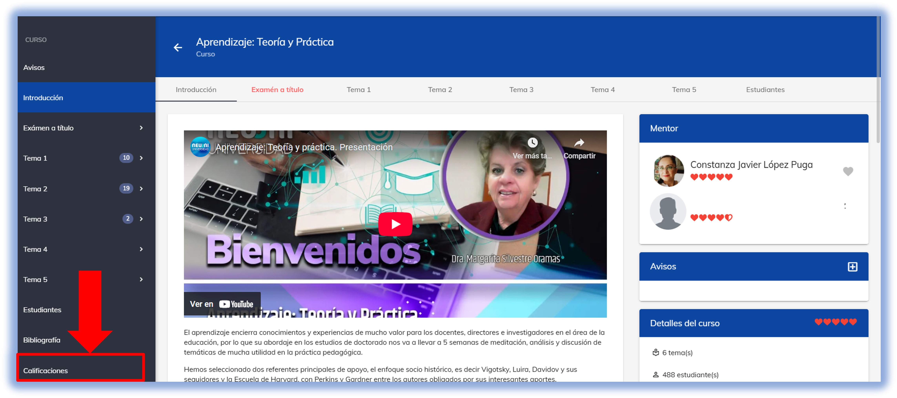
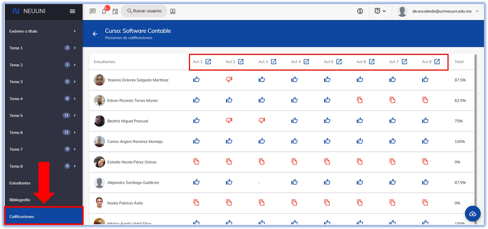
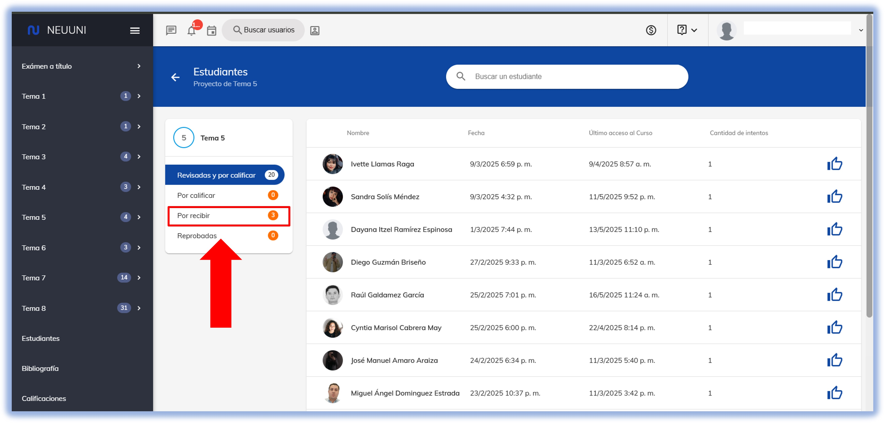
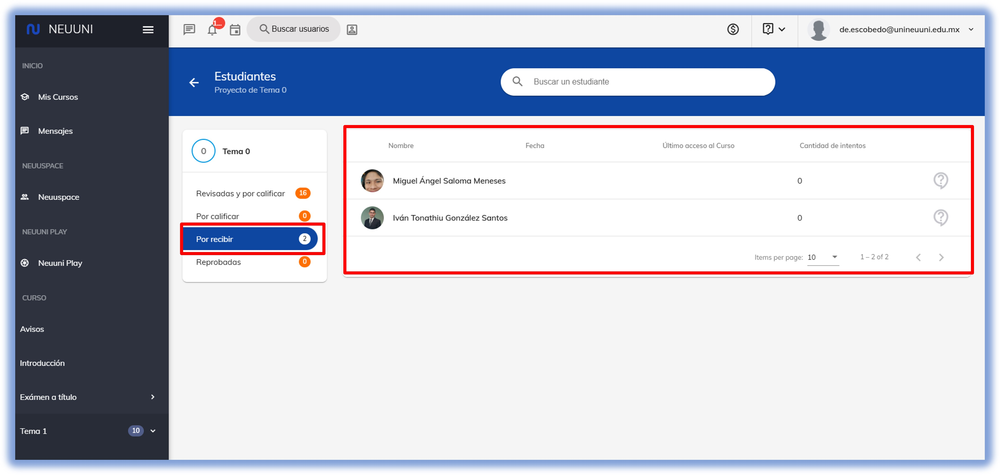
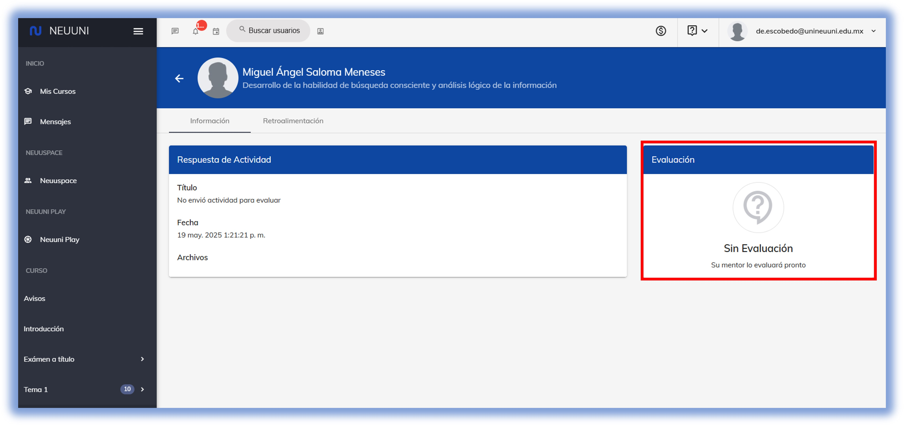
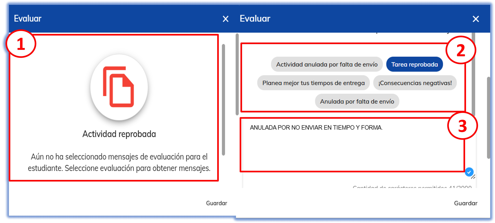

import CustomLink from '@site/docs/tutorial-basics/CustomLink.jsx'

# ❌Reprobar actividades

## Anula los envíos no realizados

### 1. Acceso a la plataforma

Ingresa a [NEUUNI](https://unineuuni.edu.mx/) y accede a tu materia indicada. 

Una vez dentro, dirígete al menú de navegación y desplázate hasta la última opción **Calificaciones**, como se muestra en la imagen.

### 2. Ubica el envío de la actividad

Selecciona, en el acceso directo de los envíos de actividades, el número de tema que corresponda. Verifica en el sumario de envíos aquellos alumnos
con falta de envío, para que puedas evaluarlos lo más pronto posible.

Después de seleccionar el número de tema, dirígete al sumario de calificaciones y elige la opción **Por recibir**, la cual mostrará a los alumnos que no enviaron la actividad.

Selecciona al alumno que no presentó la actividad, para que se muestre la siguiente pantalla. Haz clic en **Evaluación**.

### 3. Cuadro de diálogo para reprobar

Para **reprobar** la actividad, marca las opciones según se indique y añade un comentario indicando el motivo.
Selecciona la opción **Guardar** para registrar la evaluación y el comentario correspondiente.

