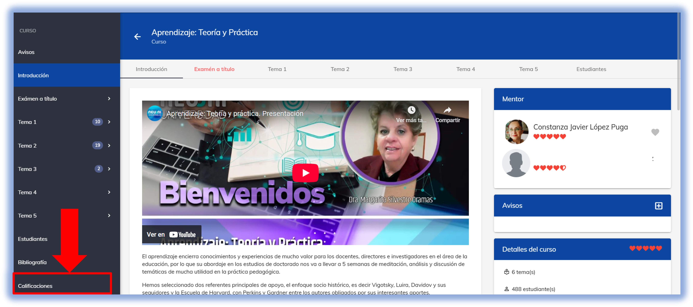
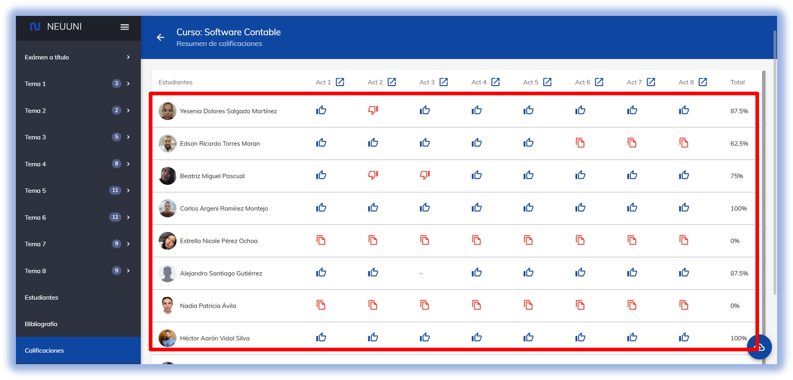

import CustomLink from '@site/docs/tutorial-basics/CustomLink.jsx'

# ¿Como reprobar actividad no enviada?

## 1. Acceso a la plataforma

- Ingresa a [NEUUNI](https://unineuuni.edu.mx/) una vez dentro accede a tu materia indicada. 

Al ingresar nos ubicamo en nuetro menu de navegación en donde si nos desplegamos hasta la ultima opción 
que nos proporciona plataforma nos da la opcion de calificaciones como se ve en la imagen.

